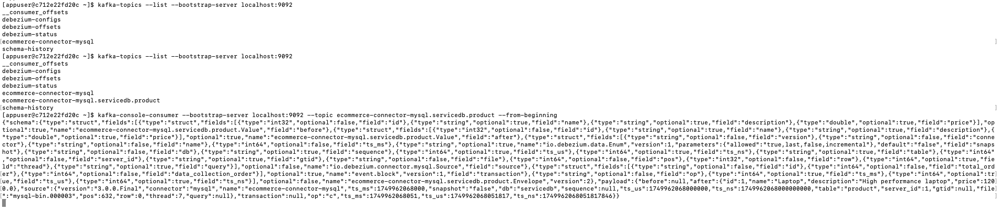

### MYSQL, KAFKA, ZOOKEEPER, debezium-connect

* docker compose down -v
* docker compose up -d

more ...

SELECT User, Host FROM mysql.user;
SHOW SLAVE STATUS;

CREATE TABLE product (
id INT AUTO_INCREMENT PRIMARY KEY,
name VARCHAR(100),
description TEXT,
price DOUBLE
);

INSERT INTO product (id, name, description, price) VALUES
(1, 'Laptop', 'High performance laptop', 1200.00);

SELECT * FROM product;

SHOW MASTER STATUS;
SELECT variable_value as "BINARY LOGGING STATUS (log-bin) ::"
FROM performance_schema.global_variables WHERE variable_name='log_bin';

SHOW GLOBAL VARIABLES LIKE 'log_bin';
SHOW GLOBAL VARIABLES LIKE 'binlog_format';
SHOW GLOBAL VARIABLES LIKE 'server_id';

SHOW GLOBAL VARIABLES LIKE 'gtid_mode';
GRANT SELECT, RELOAD, SHOW DATABASES, REPLICATION SLAVE, REPLICATION CLIENT ON *.* TO 'app'@'%';
FLUSH PRIVILEGES;

SELECT * FROM product;
* To see binary logs (docker ps → to check container name)
docker exec -it mysql-docker-mysql-1  mysql -u root -p
cd /var/lib/mysql  

* To see kafka topics  
  docker exec -it mysql-docker-kafka-1 bash  
  kafka-topics --list --bootstrap-server localhost:9092  
  kafka-console-consumer --bootstrap-server localhost:9092 --topic ecommerce-connector-mysql.servicedb.product --from-beginning

* POST kafka connect config once containers are up

more ...

POST : http://localhost:8083/connectors
PAYLOAD :
{
    "name": "mysql-connector",
    "config": {
        "connector.class": "io.debezium.connector.mysql.MySqlConnector",
        "tasks.max": "1",
        "database.hostname": "mysql",
        "database.port": "3306",
        "database.user": "app",
        "database.password": "app123",
        "database.server.id": "184054",
        "database.server.name": "ecommerce",
        "database.include.list": "servicedb",
        "schema.history.internal.kafka.bootstrap.servers": "kafka:9092",
        "schema.history.internal.kafka.topic": "schema-history",
        "topic.prefix": "ecommerce-connector-mysql"
    }
}

* Create table product and insert data into it
* Expect a new topic ecommerce-connector-mysql.servicedb.product
* All Create, Update and Delete operations can be captured in the topic
    

